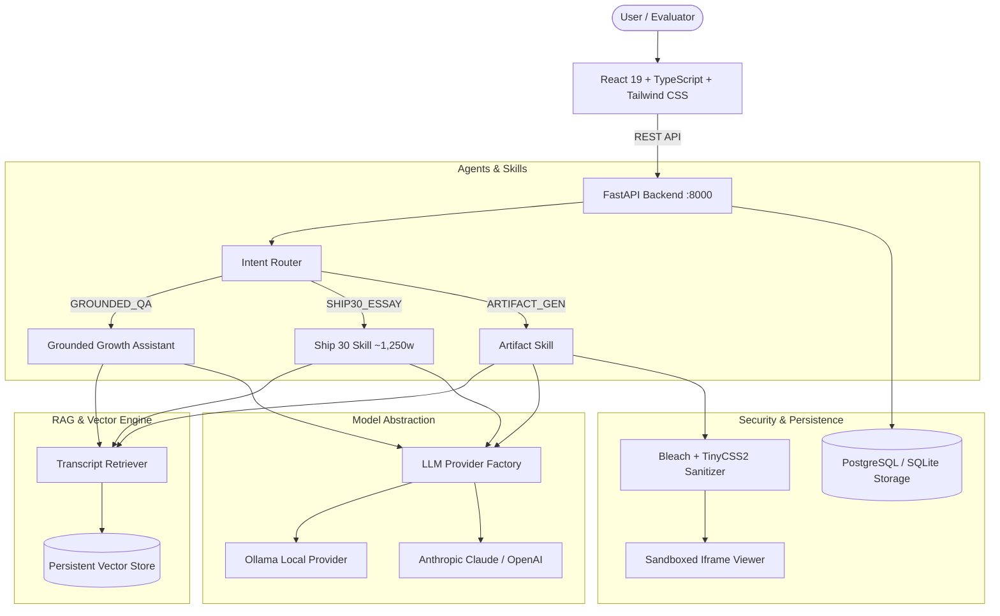

# The Lenny Growth Assistant

> **An enterprise-grade, evaluator-friendly AI product advisor strictly grounded in Lenny's Podcast transcripts.**

Built for product leaders, growth practitioners, and hiring evaluators. Features semantic sliding-window transcript retrieval with direct YouTube timestamp citations, dedicated Ship 30 for 30 essay generation (~1,250 words), and an isolated in-app Artifact Viewer for interactive HTML and Markdown frameworks.

---

## 1. Project Overview
"The Lenny Growth Assistant" ingests over 300 deep-dive podcast interviews from [Lenny's Podcast Transcript Knowledge Base](https://github.com/ChatPRD/lennys-podcast-transcripts) (Adam Fishman, Elena Verna, Brian Balfour, Julie Zhuo, Casey Winters, etc.). It delivers:
- **Strict Grounding**: Zero hallucinated claims. The assistant references only what real guests stated, transparently refusing when evidence is insufficient.
- **Source Transparency**: Every claim cites the episode title, guest name, active speaker, timestamp (`HH:MM:SS`), and a direct playback link to YouTube.
- **Ship 30 for 30 Content Skill**: Generates high-impact ~1,250-word atomic essays structured with 1-3-1 hook rhythms, numbered framework pillars, bold sentence anchors, and actionable Monday execution checklists.
- **Artifact Viewer**: Claude-style side-by-side artifact panel rendering sanitized, isolated HTML/CSS cards and Markdown strategy briefs.
- **Provider Flexibility**: Runs offline locally with **Ollama** (`llama3.2`, `mistral`, `llama3`) or cloud providers (**Anthropic Claude**, **OpenAI**) without code modification.

---

## 2. Problem Statement
Product managers and founders frequently search for tactical guidance on onboarding, retention loops, monetization, and experimentation. Generic foundation models frequently hallucinate frameworks or miss nuanced practitioner advice. Conversely, manual searching through 300+ hours of podcast audio or raw transcripts is tedious.

The Lenny Growth Assistant bridges this gap by indexing speaker-diarized transcripts into a queryable semantic vector store, pairing it with dedicated specialized skills and isolated document previewing.

---

## 3. Key Features

- 🎙️ **Transcript-Grounded Q&A**: Answers complex growth queries using authentic Lenny's Podcast dialogue turns.
- 🔗 **Timed YouTube Citations**: Every quote provides a link directly to the video timestamp (`&t=Xs`).
- ✍️ **Ship 30 for 30 Essay Skill**: Dedicated multi-stage pipeline producing ~1,250-word publication-ready essays.
- 🎨 **In-App Artifact Viewer**: Split-screen preview for interactive HTML/CSS frameworks and Markdown documents.
- 🛡️ **HTML Security & Sandboxing**: Server-side Bleach + TinyCSS2 sanitization + client-side sandboxed `<iframe>` (`sandbox="allow-same-origin"`).
- 🔄 **Hot-Swappable LLM Providers**: Toggle between local Ollama and Cloud Claude/OpenAI on the fly.
- 💾 **Isolated Session Persistence**: PostgreSQL backend (with auto-fallback to SQLite) ensuring conversations and artifacts are strictly isolated.
- 🩺 **Self-Diagnostic Panel**: Real-time observability over model health, database connectivity, and vector index chunk counts.

---

## 4. Architecture Overview



---

## 5. Tech Stack

- **Frontend**: React 19, TypeScript, Vite, Tailwind CSS, Lucide React, React-Markdown, Remark-GFM.
- **Backend**: Python 3.10+, FastAPI, Pydantic v2, SQLAlchemy 2.0 (Async), Bleach, TinyCSS2, BeautifulSoup4.
- **Database**: PostgreSQL 16 with pgvector (Docker) / SQLite with aiosqlite (local zero-config fallback).
- **AI & RAG**: Ollama (`llama3.2`, `mistral`), Anthropic Claude (`claude-3-5-sonnet-20241022`), SentenceTransformers / Hashed Embeddings, Numpy cosine similarity.
- **Testing**: Pytest, Pytest-Asyncio, HTTPX TestClient (21 passing tests).
- **Deployment**: Docker, Docker Compose, Nginx.

---

## 6. Prerequisites

- **Python**: 3.10 or higher.
- **Node.js**: v18 or higher (v24 tested).
- **Ollama** (for local offline demo): [https://ollama.com](https://ollama.com)
- *(Optional)* **Docker & Docker Compose** (for containerized execution).

---

## 7. Ollama Setup (Mandatory Local Demo)

1. Download and install Ollama from [ollama.com](https://ollama.com).
2. Start the Ollama daemon:
   ```bash
   ollama serve
   ```
3. Pull the recommended local model:
   ```bash
   ollama pull llama3.2
   ```
   *(Alternative tested models: `mistral`, `llama3`, `qwen2.5:7b`)*
4. Verify Ollama is responsive:
   ```bash
   ollama list
   ```

---

## 8. Cloud LLM Setup (Optional)

To evaluate with cloud models:
1. In your `.env` file, set:
   ```env
   LLM_PROVIDER=anthropic
   ANTHROPIC_API_KEY=sk-ant-api03-...
   ANTHROPIC_MODEL=claude-3-5-sonnet-20241022
   ```
2. Or for OpenAI:
   ```env
   LLM_PROVIDER=openai
   OPENAI_API_KEY=sk-...
   OPENAI_MODEL=gpt-4o
   ```
You can switch providers dynamically in the application UI without restarting!

---

## 9. Environment Variables

Copy `.env.example` to `.env`:
```bash
cp .env.example .env
```

| Variable | Default | Description |
| :--- | :--- | :--- |
| `APP_ENV` | `development` | Runtime environment (`development` / `production`). |
| `HOST` | `0.0.0.0` | Backend bind host. |
| `PORT` | `8000` | Backend API port. |
| `DATABASE_URL` | `sqlite+aiosqlite:///./lenny_growth.db` | PostgreSQL or SQLite connection URI. |
| `LLM_PROVIDER` | `ollama` | Active provider (`ollama`, `anthropic`, `openai`). |
| `OLLAMA_BASE_URL`| `http://localhost:11434` | URL to Ollama HTTP daemon. |
| `OLLAMA_MODEL` | `llama3.2` | Ollama model identifier. |
| `ANTHROPIC_API_KEY`| `""` | Anthropic Claude API Key (optional). |
| `VECTOR_STORE_PATH`| `./data/vector_store` | Path for indexed vector embeddings. |

---

## 10. Database Setup & Persistence

The application includes an **Automatic Fallback Engine**:
- If PostgreSQL is available, it connects using async SQLAlchemy.
- If PostgreSQL is not active on startup, it automatically falls back to `./lenny_growth.db` (SQLite) with zero user intervention required!
- **Strict Isolation**: Chat sessions, messages, and artifacts are strictly queried with `WHERE session_id = :id`. Chat A can never leak into Chat B.

---

## 11. Transcript Ingestion Pipeline

The knowledge base is built from [ChatPRD/lennys-podcast-transcripts](https://github.com/ChatPRD/lennys-podcast-transcripts).

To ingest and index episodes:

```bash
# Ingest top episodes:
python scripts/ingest_transcripts.py --limit 15

# Or ingest all 300+ episodes:
python scripts/ingest_transcripts.py --all

# Force re-indexing of existing chunks:
python scripts/ingest_transcripts.py --force
```

Each chunk retains:
- Episode Title & Guest Name
- Speaker Diarization & Timestamp (`HH:MM:SS`)
- Direct timed YouTube playback URL (`https://youtube.com/watch?v=...&t=Xs`)
- Diarized text turn

---

## 12. Running Locally (Step-by-Step)

### Option A: Local Dev Server (Fastest for Evaluator)

1. **Install backend dependencies**:
   ```bash
   pip install -r backend/requirements.txt
   ```
2. **Seed or verify sample knowledge base**:
   ```bash
   python scripts/ingest_transcripts.py --limit 2
   ```
3. **Start the FastAPI backend**:
   ```bash
   python -m uvicorn backend.app.main:app --port 8000 --reload
   ```
   *Verify backend at: `http://localhost:8000/health` or `http://localhost:8000/docs`.*

4. **In a second terminal, start the React frontend**:
   ```bash
   cd frontend
   npm install
   npm run dev
   ```
5. **Open your browser**:
   Navigate to `http://localhost:5173`.

---

### Option B: Docker Compose

```bash
# 1. Copy environment template
cp .env.example .env

# 2. Launch PostgreSQL, Backend, and Frontend containers
docker compose up --build
```
- Frontend: `http://localhost:5173`
- Backend API Docs: `http://localhost:8000/docs`

---

## 13. Running Automated Tests

Run the complete pytest suite:

```bash
pytest backend/tests -v
```

All 21 tests cover:
- `test_api.py`: Session CRUD, chat endpoint, validation errors, readiness.
- `test_persistence.py`: Session isolation, message ordering, artifact persistence.
- `test_retrieval.py`: Transcript parsing, timed YouTube URLs, vector retrieval.
- `test_router.py`: Intent classification (Growth Q&A, Ship30, Artifact).
- `test_llm.py`: Provider factory, Ollama offline handling, Claude key validation.
- `test_security.py`: HTML sanitizer stripping `<script>`, inline handlers, and bad protocols.

---

## 14. API Overview

| Method | Endpoint | Description |
| :--- | :--- | :--- |
| `GET` | `/health` | Service liveness probe. |
| `GET` | `/ready` | Service readiness probe (Ollama, DB, Vector chunk counts). |
| `POST` | `/api/sessions` | Create a new isolated conversation session. |
| `GET` | `/api/sessions` | List all conversation sessions. |
| `GET` | `/api/sessions/{id}`| Fetch session details, message thread, and artifacts. |
| `DELETE`| `/api/sessions/{id}`| Delete session and cascaded messages/artifacts. |
| `POST` | `/api/chat` | Send message, route intent, retrieve context, return answer & citations. |
| `POST` | `/api/artifacts` | Create and sanitize an artifact. |
| `GET` | `/api/artifacts/{id}`| Retrieve an artifact by ID. |

---

## 15. Troubleshooting

- **Ollama Connection Refused**:
  - Make sure `ollama serve` is running in a terminal.
  - Verify that `ollama list` shows `llama3.2` or your chosen model.
  - Check the Diagnostics modal in the frontend header.
- **Port Conflicts**:
  - Backend runs on `8000`, frontend on `5173`. If occupied, adjust `PORT` in `.env` and `vite.config.ts`.
- **Empty Vector Store**:
  - Run `python scripts/ingest_transcripts.py --limit 5` to populate the index.

---

## 16. Security Notes

- **Untrusted HTML**: Generated HTML/CSS artifacts are treated as untrusted user input.
- **Server Sanitization**: `bleach` and `tinycss2` strip all `<script>`, `<object>`, `<embed>`, inline event handlers (`onclick`, `onload`), and dangerous URI schemes (`javascript:`, `data:text/html`).
- **Client Sandboxing**: The Artifact Viewer uses an isolated `<iframe>` with `sandbox="allow-same-origin"` and `srcDoc` rendering, preventing parent DOM tampering or token exfiltration.
- **Secret Isolation**: Never commit API keys; `.env` is ignored in `.gitignore`.

---

## 17. Design Decisions & Trade-Offs

1. **Sliding-Window Dialogue Chunking vs. Fixed Characters**:
   - *Decision*: Grouped 2-4 conversational turns rather than splitting at arbitrary character boundaries.
   - *Rationale*: Preserves speaker context (e.g., Lenny asking a question followed by the guest's detailed framework).
2. **Dual-Database Strategy**:
   - *Decision*: PostgreSQL for production with automatic transparent fallback to SQLite.
   - *Rationale*: Eliminates evaluator friction. An evaluator without a running Docker daemon can still run the entire application immediately.
3. **Dedicated Ship 30 Skill vs. Mega-Prompt**:
   - *Decision*: Separated Ship 30 essay generation into a discrete skill rather than stuffing rules into the main prompt.
   - *Rationale*: Avoids instruction dilution and guarantees consistent ~1,250-word depth and 1-3-1 formatting.

---

## 18. Future Improvements

- **Hybrid Semantic + BM25 Lexical Search (SPLADE/Reciprocal Rank Fusion)**: Further optimize precision on rare guest names.
- **Streaming Tokens via Server-Sent Events (SSE)**: Enable word-by-word streaming for long Ship 30 essay generation.
- **Audio Snippet Playback**: Embed timestamped audio player directly in citation cards.
