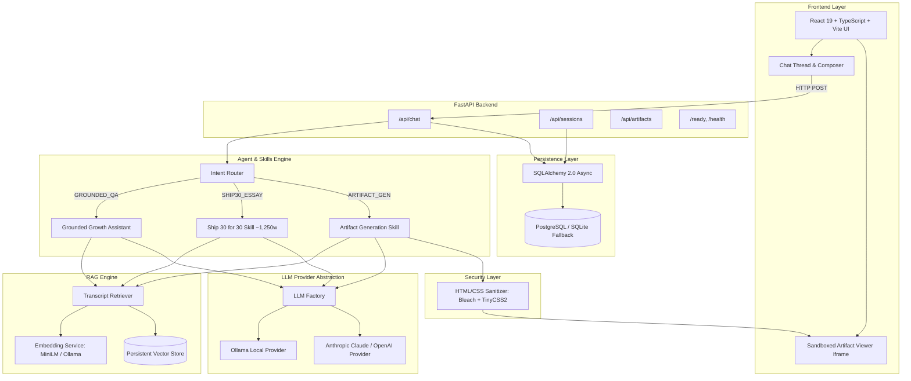
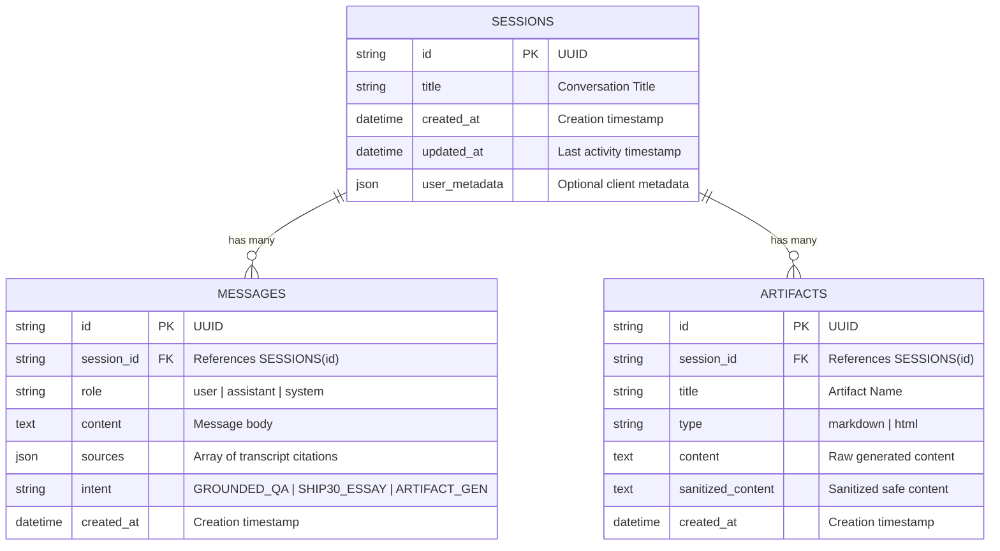
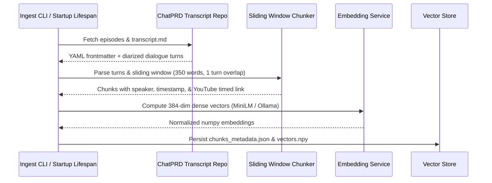

# System Architecture Document
# The Lenny Growth Assistant

## 1. System Architecture Overview

The Lenny Growth Assistant is an enterprise-grade AI system designed to ingest, index, and query over 300 deep-dive podcast transcripts from Lenny's Podcast. It enforces strict context grounding, provides direct YouTube video timestamp citations, generates ~1,250-word Ship 30 essays, and renders isolated HTML/Markdown artifacts.



---

## 2. Component Boundaries & Responsibilities

| Component | Path | Responsibility |
| :--- | :--- | :--- |
| **FastAPI App** | `backend/app/main.py` | Request dispatching, CORS, structured logging, error handling, startup seeding. |
| **API Endpoints** | `backend/app/api/` | REST controllers for sessions, messages, artifacts, health diagnostics. |
| **Intent Router** | `backend/app/agents/router.py` | Classifies incoming intent (`GROUNDED_QA`, `SHIP30_ESSAY`, `ARTIFACT_GEN`). |
| **Growth Agent** | `backend/app/agents/growth_assistant.py` | Enforces transcript grounding, checks confidence threshold, attributes citations. |
| **Ship 30 Skill** | `backend/app/agents/skills/ship30.py` | 3-stage transformation to ~1,250 word essay with 1-3-1 hook and execution checklist. |
| **Artifact Skill** | `backend/app/agents/skills/artifact_gen.py` | Generates standalone HTML/CSS cards and Markdown frameworks. |
| **HTML Sanitizer** | `backend/app/security/sanitizer.py` | Defangs untrusted HTML, strips `<script>` tags, inline handlers, and bad protocols. |
| **LLM Abstraction**| `backend/app/llm/` | Unified provider interface for local Ollama and Cloud Claude/GPT-4o. |
| **RAG Ingestion** | `backend/app/retrieval/` | Parses YAML frontmatter, speaker diarization, chunking, and vector indexing. |
| **Data Models** | `backend/app/db/` | SQLAlchemy models and session-isolated query repositories. |

---

## 3. Database Schema

The persistence layer uses PostgreSQL (with pgvector support in Docker) and automatically falls back to SQLite for zero-friction local execution.



### Strict Session Isolation
All database reads and writes in `app/db/repositories.py` explicitly filter queries by `session_id`. Messages and artifacts from Session A are strictly segregated from Session B at the database layer.

---

## 4. Ingestion & Retrieval Flow



---

## 5. Security Architecture & Threat Model

Generated HTML from LLMs must be treated as untrusted user input:

```
LLM Output (Raw HTML)
    │
    ▼
[Server-Side Sanitizer]
    ├── Strips <script>, <object>, <embed>, <iframe>
    ├── Strips all on* attributes (onclick, onload, onerror)
    ├── Validates URL schemes (blocks javascript:, data:text/html, vbscript:)
    └── Sanitizes CSS styles via Bleach CSSSanitizer (TinyCSS2)
    │
    ▼
[Database Persistence] (Saved as sanitized_content)
    │
    ▼
[Frontend Sandbox Isolation]
    └── Rendered in <iframe sandbox="allow-same-origin" srcDoc={sanitized_content} />
        (Prevents access to parent window, localStorage, or cookies)
```

---

## 6. Observability & Failure Handling

The application logs every major transaction with request IDs, response durations, and error details:

- **LLM Offline Handling**: When Ollama or Cloud API is unreachable, the system does not crash or throw unhandled 500s. It returns a structured error to the client with exact setup instructions (`ollama serve`).
- **Low Confidence Retrieval Handling**: If cosine similarity is below 0.22, the assistant explicitly reports that evidence is insufficient rather than hallucinating answers.
- **Database Fallback**: If PostgreSQL connection is refused, the database engine transparently spins up local SQLite storage (`lenny_growth.db`).
