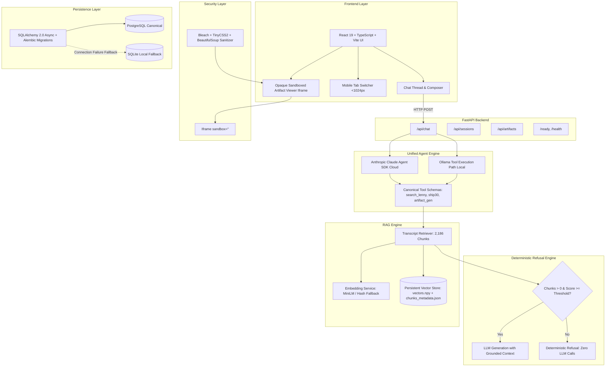
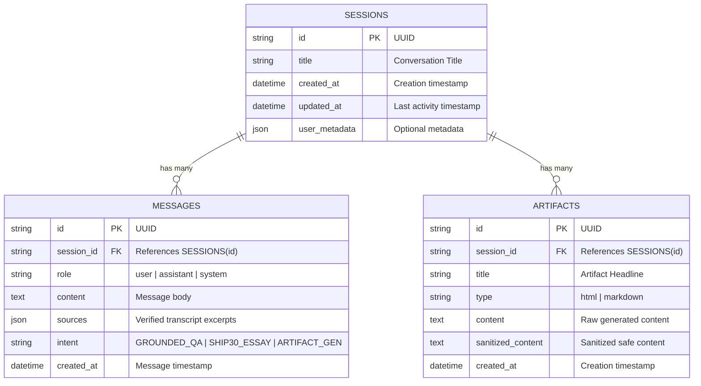

# System Architecture Document
# The Lenny Growth Assistant

## 1. System Architecture Overview

The Lenny Growth Assistant is an enterprise-grade AI system designed to ingest, index, and query deep-dive podcast transcripts from Lenny's Podcast. It enforces strict transcript grounding, provides direct YouTube video timestamp citations, generates ~1,250-word Ship 30 essays, and renders isolated HTML/Markdown artifacts.

```
CLOUD MODE:
Claude Agent SDK (`claude-agent-sdk`, in-process MCP tools)
        ↓
Canonical Tools:
  - search_lenny_transcripts
  - generate_ship30_essay
  - create_product_artifact
        ↓
Retrieval Engine (2,186 Chunks) / Ship30 Skill / Artifact Skill

LOCAL MODE (Mandatory Demo):
Ollama-compatible local tool execution path
        ↓
The SAME Canonical Tools:
  - search_lenny_transcripts
  - generate_ship30_essay
  - create_product_artifact
        ↓
Retrieval Engine (2,186 Chunks) / Ship30 Skill / Artifact Skill
```



---

## 2. Component Boundaries & Responsibilities

| Component | Path | Responsibility |
| :--- | :--- | :--- |
| **FastAPI App** | `backend/app/main.py` | Lifespan diagnostics banner, CORS, structured logging, request correlation IDs. |
| **API Endpoints** | `backend/app/api/` | REST controllers for sessions, messages, artifacts, health diagnostics. |
| **Unified Agent Engine** | `backend/app/agents/core.py` | Official Anthropic Claude Agent SDK for cloud mode; Ollama-compatible execution loop for local mode. |
| **Canonical Tools** | `backend/app/agents/core.py` | `search_lenny_transcripts`, `generate_ship30_essay`, `create_product_artifact`. |
| **Growth Agent** | `backend/app/agents/growth_assistant.py` | Hard programmatic refusal guard before LLM generation; citation attribution. |
| **Ship 30 Skill** | `backend/app/agents/skills/ship30.py` | High-impact ~1,250-word atomic essays with 1-3-1 hook and execution checklist. |
| **Artifact Skill** | `backend/app/agents/skills/artifact_gen.py` | Generates isolated HTML/CSS cards and Markdown frameworks. |
| **HTML Sanitizer** | `backend/app/security/sanitizer.py` | Defangs untrusted HTML, strips `<script>`, event handlers, SVG attacks, and CSS vectors. |
| **LLM Abstraction**| `backend/app/llm/` | Unified provider interface for local Ollama (`myphi3:latest`, `llama3.2`) and Cloud Claude. |
| **RAG Engine** | `backend/app/retrieval/` | Speaker diarization, timestamp preservation, sliding-window chunker, and vector indexing. |
| **Persistence** | `backend/app/db/` | Canonical PostgreSQL with Alembic migrations + transparent local SQLite fallback. |

---

## 3. Database Architecture & Alembic Migrations

PostgreSQL is the canonical database. Schema versioning is managed via Alembic:
- Configuration: `backend/alembic.ini`
- Initial Migration: `backend/alembic/versions/001_initial_schema.py`

### Transparent Fallback to SQLite
If PostgreSQL is unreachable at startup, `backend/app/db/database.py` catches the connection failure, logs:
```
[FALLBACK] PostgreSQL unreachable. Operating in local SQLite compatibility mode.
```
and automatically routes all queries to `./lenny_growth.db` via `aiosqlite`.



---

## 4. Deterministic RAG Refusal Architecture

To eliminate hallucination risks, `GrowthAssistantAgent` implements a strict programmatic guard BEFORE LLM invocation:

1. **Retrieval Step**: `await retriever.retrieve(query=question, top_k=top_k)`.
2. **Hard Programmatic Guard**:
   - Condition: `len(retrieved_chunks) == 0 or retrieved_chunks[0].score < threshold`.
   - Threshold is configurable via `settings.RAG_CONFIDENCE_THRESHOLD` (default: `0.22`).
3. **If Insufficient**:
   - Returns immediately with:
     ```json
     {
       "answer": "Based on the available Lenny's Podcast transcript material, there is insufficient evidence to provide a grounded answer to this question.",
       "sources": [],
       "evidence_sufficient": false
     }
     ```
   - **Zero LLM tokens are consumed, and the LLM is never invoked.**
4. **If Sufficient**:
   - Constructs grounded prompt with guest quotes and timestamps.
   - Dispatches prompt to LLM.
   - Attaches verified source citations with direct YouTube timed URLs (`&t=Xs`).

---

## 5. Security & Isolation Architecture

Artifacts generated by LLMs are treated as untrusted third-party code. Isolation is achieved through defense-in-depth:

1. **Server-Side Sanitization**:
   - Bleach HTML tag whitelist (`div`, `p`, `h1`-`h6`, `table`, `ul`, `ol`, `span`, `style`, safe SVG).
   - BeautifulSoup pre-processing stripping prohibited tags (`script`, `iframe`, `object`, `embed`, `animate`, `set`).
   - Stripping of all inline event handlers (`onclick`, `onload`, `onmouseover`, SVG `onload`).
   - Neutralization of dangerous URL schemes (`javascript:`, `data:text/html`, entity-encoded variants).
   - Neutralization of CSS vectors: `@import`, `expression(...)`, `behavior:`, `-moz-binding`, `url(javascript:...)`.
2. **Client-Side Opaque Sandbox**:
   - In `ArtifactViewer.tsx`, the iframe is configured with `sandbox=""`.
   - Scripts are forbidden.
   - The document is placed in a unique opaque `null` origin, preventing same-origin access to the parent application DOM, cookies, localStorage, or API tokens.

---

## 6. Responsive UX Design

On desktop screens (`>=1024px`):
- Side-by-side split-screen layout with Chat and Artifact Viewer visible simultaneously.

On tablet and mobile screens (`<1024px`):
- Responsive segmented tab bar allows toggling between `Chat Thread` and `Artifact Preview`.
- Artifact panel can be collapsed with a single click, returning full width to the chat.
- The chat thread remains 100% usable, comfortable, and never horizontally squished.

---

## 7. Knowledge Base & Ingestion Pipeline

- **Corpus Scope**: Ingested from `ChatPRD/lennys-podcast-transcripts`.
- **Indexed Scope**: **2,186 authentic chunks** from **47 real episodes** in the current vector store.
- **Ingestion CLI**: `scripts/ingest_transcripts.py` supports `--limit`, `--all`, and `--force`.
- **Deduplication**: Deterministic chunk IDs (`{slug}_{turn_idx}`) prevent duplicate indexing across runs.

## 8. Verification Status and Known Limitations

- The cloud path uses the Python Claude Agent SDK (`claude-agent-sdk`) with three in-process MCP tools: `search_lenny_transcripts`, `generate_ship30_essay`, and `create_product_artifact`.
- The local path uses Ollama and the same domain capabilities through a separate local dispatcher; the Claude Agent SDK is not used to drive Ollama.
- Grounded Q&A refuses programmatically before LLM generation when retrieval is empty or below `RAG_CONFIDENCE_THRESHOLD`.
- The current local recommendation is `qwen2.5:0.5b`; a real generation check depends on the model being installed and enough host memory being available.
- PostgreSQL is canonical and Alembic is present, but Docker/PostgreSQL runtime verification is environment-dependent.
- The frontend artifact viewer uses an opaque `sandbox=""` iframe, and server-side sanitization remains in force.
